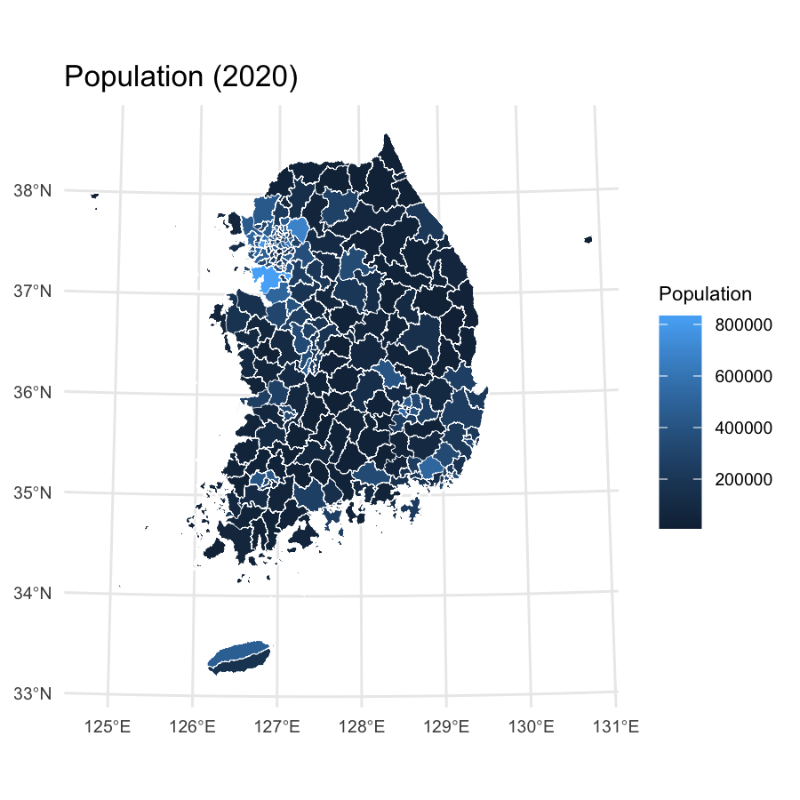
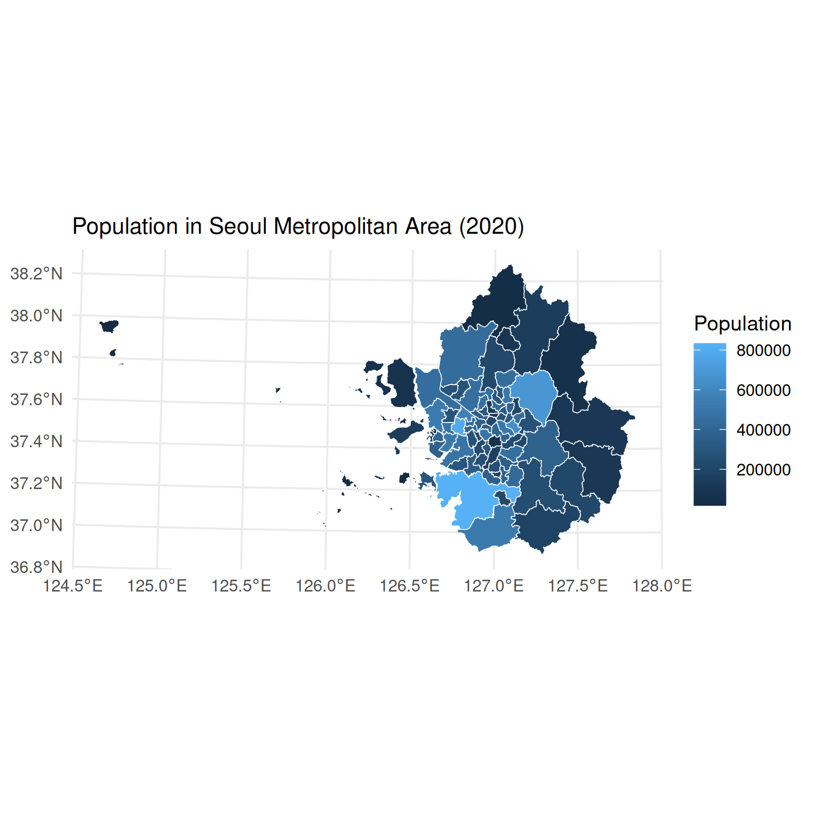
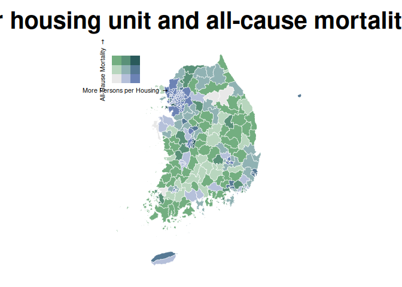

[](https://sigmafelix.r-universe.dev/tidycensuskr)
[](https://cran.r-project.org/package=tidycensuskr)
[](https://cran.r-project.org/package=tidycensuskr)

# Who is the package for?

The `tidycensuskr` package is designed for R users who want to work with
South Korean census and administrative boundary data. It aims to provide
an easy-to-use interface for population, housing, and socioeconomic
statistics linked with geospatial boundaries.

<a href='https://sigmafelix.github.io/tidycensuskr/'></a>

# Installation

You can install the released version of `tidycensuskr` from CRAN with:

``` r
# CRAN
install.packages("tidycensuskr")

# R-universe
install.packages("tidycensuskr", repos = "https://sigmafelix.r-universe.dev")
```

To install the development version, `remotes::install_github()` will
suffice.

``` r
# Development version from GitHub
rlang::check_installed("remotes")
remotes::install_github("sigmafelix/tidycensuskr")
```

# About the data

As of September 2025, this package contains two datasets: Census data
(`censuskor`) and the corresponding geospatial data.

## 1. Census data

- Sigungu dataset of three census years (2010, 2015, 2020)
  - The curated dataset is a **long** table (i.e., one row per
    district-year-variable)

### `anycensus()`

- The function `anycensus()` allows you to query census data for
  specific district or province codes and types of data (population,
  tax, mortality, economy, housing) for three census years (2010, 2015,
  2020).

``` r
# loading Seoul population data
tidycensuskr::anycensus(codes = "Seoul", type = "population")
#> # A tibble: 25 × 17
#>     year adm1  adm1_code adm2          adm2_code type     all households_total…¹
#>    <dbl> <chr>     <dbl> <chr>             <dbl> <chr>                     <dbl>
#>  1  2020 Seoul        11 Dobong-gu         11100 populat…                 312878
#>  2  2020 Seoul        11 Dongdaemun-gu     11060 populat…                 332796
#>  3  2020 Seoul        11 Dongjak-gu        11200 populat…                 378749
#>  4  2020 Seoul        11 Eunpyeong-gu      11120 populat…                 458777
#>  5  2020 Seoul        11 Gangbuk-gu        11090 populat…                 295304
#>  6  2020 Seoul        11 Gangdong-gu       11250 populat…                 440022
#>  7  2020 Seoul        11 Gangnam-gu        11230 populat…                 509899
#>  8  2020 Seoul        11 Gangseo-gu        11160 populat…                 564114
#>  9  2020 Seoul        11 Geumcheon-gu      11180 populat…                 225594
#> 10  2020 Seoul        11 Guro-gu           11170 populat…                 394733
#> # ℹ 15 more rows
#> # ℹ abbreviated name: ¹​`all households_total_prs`
#> # ℹ 10 more variables: `all households_male_prs` <dbl>,
#> #   `all households_female_prs` <dbl>, fertility_total_brt <dbl>,
#> #   `fertility_15-19 (simulated)_bp1` <dbl>, `fertility_20-24_bp1` <dbl>,
#> #   `fertility_25-29_bp1` <dbl>, `fertility_30-34_bp1` <dbl>,
#> #   `fertility_35-39_bp1` <dbl>, `fertility_40-44_bp1` <dbl>, …
```

### `censuskor`

- The function `data(censuskor)` loads an attached dataset that contains
  the census data in long form. This dataset is automatically loaded
  upon loading the package.

## 2. Administrative boundaries

### `load_district()`

- The function `load_district()` allows you to get the *Si-Gun-Gu* level
  `sf` files for the three census years (2010, 2015, 2020).
- The function requires the `tidycensuskr.sf` package to be installed.
  Please install it from [R-universe](https://sigmafelix.r-universe.dev)
  using
  `install.packages("tidycensuskr.sf", repos = "https://sigmafelix.r-universe.dev")`.

``` r
# loading boundary sf file: 2020 boundaries are included in this package
data(adm2_sf_2020)
# tidycensuskr.sf::load_districts(year = 2020)
```

# Examples

Package vignettes are the first place to look for detailed examples.
Below are some quick examples to get you started.

## Simple map making

`anycensus()` will return an analysis-ready data.frame that can be
easily merged with the corresponding boundary `sf` object from
`load_districts()`. Here is a simple example of making maps with
population data.

``` r
library(tidycensuskr)
#> tidycensuskr 0.2.8 (2026-04-28)
#> Please install the companion data package tidycensuskr.sf to use the district boundaries.
#> install.packages('tidycensuskr.sf', repos = 'https://sigmafelix.r-universe.dev')
library(ggplot2)
library(dplyr)
#> 
#> Attaching package: 'dplyr'
#> The following objects are masked from 'package:stats':
#> 
#>     filter, lag
#> The following objects are masked from 'package:base':
#> 
#>     intersect, setdiff, setequal, union
library(tidyr)
library(sf)
#> Linking to GEOS 3.12.1, GDAL 3.8.4, PROJ 9.4.0; sf_use_s2() is TRUE
library(biscale)
library(cowplot)
sf_use_s2(FALSE)
#> Spherical geometry (s2) switched off
options(scipen = 100)

# load census data
census_pop_2020 <- anycensus(year = 2020, codes = NULL, type = "population")
#> Using character codes that are convertible to integers. Automatically converting to integers...
census_pop_2020 <- census_pop_2020 |>
  rename(population_total = `all households_total_prs`)

# load boundaries
data(adm2_sf_2020)
adm2_2020 <- adm2_sf_2020

# merge boundaries and census data
census_2020_sf <- adm2_2020 |>
  left_join(census_pop_2020, by = c("adm2_code" = "adm2_code"))

# plot population data
census_2020_pop <-
  ggplot(census_2020_sf) +
  geom_sf(aes(fill = population_total), color = "white", size = 0.1) +
  theme_minimal() +
  labs(
    title = "Population (2020)",
    fill = "Population"
  ) +
  theme(
    plot.title = element_text(size = 12),
    axis.text = element_text(size = 7),
    legend.text = element_text(size = 7),
    legend.title = element_text(size = 8)
  )

census_2020_pop
```



For Seoul Metropolitan Area (including Seoul, Incheon, and Gyeonggi-do),
you can use a character vector in `codes` argument and merge the
retrieved `data.frame` and `sf` object with `inner_join()`:

``` r
census_pop_2020_sma <-
  anycensus(
    year = 2020,
    codes = c("Seoul", "Incheon", "Gyeonggi"),
    type = "population"
  ) |>
  rename(population_total = `all households_total_prs`)

census_2020_sf_sma <- adm2_2020 |>
  inner_join(census_pop_2020_sma, by = c("year", "adm2_code"))


# plot population data
census_2020_pop_sma <-
  ggplot(census_2020_sf_sma) +
  geom_sf(aes(fill = population_total), color = "white", size = 0.1) +
  theme_minimal() +
  labs(
    title = "Population in Seoul Metropolitan Area (2020)",
    fill = "Population"
  ) +
  theme(
    plot.title = element_text(size = 12),
    axis.text = element_text(size = 7),
    legend.text = element_text(size = 7),
    legend.title = element_text(size = 8)
  )

census_2020_pop_sma
```



## Bivariate map

Moving on to a complex example, the code below demonstrates to generate
a bivariate map with persons per housing unit and all-cause mortality
rate.

``` r
census_housing_2020 <- anycensus(year = 2020, codes = NULL, type = "housing")
#> Using character codes that are convertible to integers. Automatically converting to integers...
census_housing_2020 <- census_housing_2020 |>
  rename(housing_total_units = `housing types_total_cnt`)
census_pop_housing_2020 <- census_pop_2020 |>
  left_join(
    census_housing_2020 |>
      select(adm2_code, housing_total_units),
    by = "adm2_code"
  ) |>
  transmute(
    adm2_code = adm2_code,
    persons_per_housing = population_total / housing_total_units
  )
census_mort_2020 <- anycensus(year = 2020, codes = NULL, type = "mortality")
#> Using character codes that are convertible to integers. Automatically converting to integers...
census_mort_2020 <- census_mort_2020 |>
  rename(mortality_total = `all causes_total_p1p`)

census_pph_mort_2020 <- census_pop_housing_2020 |>
  left_join(
    census_mort_2020 |>
      select(adm2_code, mortality_total),
    by = "adm2_code"
  )

# merge boundaries and census data
census_2020_sf <- adm2_2020 |>
  left_join(census_pph_mort_2020, by = c("adm2_code" = "adm2_code"))
census_2020_mapbase <-
  biscale::bi_class(
    census_2020_sf,
    x = persons_per_housing,
    y = mortality_total,
    style = "quantile",
    dim = 3
  )

# draw a bivariate legend
legend <- bi_legend(
  pal = "DkCyan",
  dim = 3,
  xlab = "More Persons per Housing ",
  ylab = "All-Cause Mortality ",
  size = 6
)

# plot population data
census_2020_bmap <-
  ggplot(census_2020_mapbase) +
  geom_sf(
    aes(fill = bi_class),
    color = "white",
    size = 0.1,
    show.legend = FALSE
  ) +
  bi_scale_fill(pal = "DkCyan", dim = 3) +
  theme_minimal() +
  labs(title = "Persons per housing unit and all-cause mortality rate (2020)") +
  bi_theme(base_size = 10) +
  theme(plot.title = element_text(size = 10))

# combine map with legend
census_2020_bimap <- cowplot::ggdraw() +
  cowplot::draw_plot(census_2020_bmap, 0, 0, 1, 1) +
  cowplot::draw_plot(legend, 0.7, 0.02, 0.3, 0.3)


census_2020_bimap
```



## Filter nonautonomous districts

`detect_adm2_type()` can be used to detect nonautonomous districts
(i.e., districts that are not independent administrative units but are
part of larger cities, per *Local Autonomy Act*). This is particularly
useful when you want to focus on autonomous or nonautonomous districts
for analysis.

``` r
# detect nonautonomous districts
census_pop_2020 <- anycensus(year = 2020, type = "population")
#> Using character codes that are convertible to integers. Automatically converting to integers...
census_housing_2020 <- anycensus(year = 2020, type = "housing")
#> Using character codes that are convertible to integers. Automatically converting to integers...

census_pop_2020_auto <- detect_adm2_type(census_pop_2020, mode = "atn")
census_pop_2020_nonauto <- detect_adm2_type(census_pop_2020, mode = "non")
unique(census_pop_2020_auto$adm2_code)
#>   [1] 33040 34010 37010 38110 35010 37040 31090 31220 31040 34040 33320 37410
#>  [13] 34030 36360 35380 31050 21080 22050 24040 26040 23060 21050 34330 38330
#>  [25] 37360 37330 34350 32360 37390 32010 33020 25050 22070 22310 36310 34080
#>  [37] 33380 11100 21030 22020 25010 24010 23020 26030 11060 31080 32040 11200
#>  [49] 21060 33370 11120 11090 11250 23310 36390 11230 32030 21120 11160 31370
#>  [61] 38390 38090 11180 21110 34310 21310 37030 38070 35060 31230 35370 33360
#>  [73] 36350 36320 34020 37370 32400 38340 31100 37050 31160 35020 37310 31120
#>  [85] 11170 36330 31110 11210 11050 31250 31060 24050 36060 37020 37100 34070
#>  [97] 23070 38360 36400 21090 38320 36430 38380 31180 38400 32320 32310 34360
#> [109] 32370 31240 36370 31210 35030 35350 32390 36380 36450 35340 33030 39010
#> [121] 35040 32350 33390 35320 33350 36470 38030 11010 21010 22010 25020 23010
#> [133] 11020 26010 11070 11140 23090 38080 36010 36420 35330 37090 36040 21070
#> [145] 22040 24030 26020 23050 38350 35050 31130 34060 11110 33330 23320 31140
#> [157] 31200 31270 32340 31070 38060 21100 32070 38370 37080 21150 29010 21020
#> [169] 22030 25030 24020 23080 34340 11220 11130 39020 11080 11040 37380 31020
#> [181] 34050 31150 36480 32060 11240 35360 36030 22060 31010 21140 34380 32050
#> [193] 38050 31030 38310 37320 31170 37420 26310 37430 36460 35310 32020 11150
#> [205] 32380 31260 31380 38100 32410 37400 31280 31350 36410 37070 37350 11190
#> [217] 21040 33340 36440 37060 32330 37340 21130 23040 36020 34370 31190 11030
#> [229] 25040
unique(census_pop_2020_nonauto$adm2_code)
#>   [1] 37040 31220 34040 33320 37410 34030 36360 35380 31050 21080 22050 24040
#>  [13] 26040 37012 31023 23060 21050 34330 38330 31191 37360 37330 33044 34350
#>  [25] 32360 37390 32010 33020 25050 22070 22310 36310 34080 31092 33380 31101
#>  [37] 35012 11100 21030 22020 25010 24010 23020 26030 31042 11060 31080 32040
#>  [49] 11200 21060 34011 33370 11120 11090 11250 23310 36390 11230 32030 21120
#>  [61] 11160 31370 38390 38090 11180 21110 34310 31192 21310 37030 38070 35060
#>  [73] 31230 35370 33360 36350 36320 34020 37370 32400 38340 37050 31160 35020
#>  [85] 37310 31120 11170 36330 31110 11210 11050 31250 31060 24050 36060 31012
#>  [97] 37020 37100 34070 23070 38360 36400 21090 38320 36430 38380 31180 38400
#> [109] 33043 32320 32310 34360 32370 31240 36370 31210 35030 31103 31104 35350
#> [121] 32390 31011 36380 36450 35340 33030 39010 35040 32350 33390 35320 33350
#> [133] 36470 38115 38030 11010 21010 22010 25020 23010 11020 26010 11070 31022
#> [145] 31041 11140 38113 38114 23090 38080 36010 36420 35330 37090 36040 21070
#> [157] 22040 24030 26020 37011 23050 38350 35050 31130 34060 11110 33330 23320
#> [169] 31140 31200 31013 31270 32340 31070 38060 21100 32070 38370 33041 37080
#> [181] 31091 21150 29010 21020 22030 25030 24020 23080 34012 34340 11220 11130
#> [193] 39020 11080 11040 37380 38112 34050 33042 31150 36480 32060 11240 31021
#> [205] 31193 35360 36030 22060 21140 34380 32050 38050 38111 31030 38310 37320
#> [217] 31170 37420 26310 37430 36460 35310 35011 32020 11150 32380 31260 31380
#> [229] 38100 32410 37400 31280 31350 36410 37070 37350 11190 21040 33340 36440
#> [241] 37060 31014 32330 37340 21130 23040 36020 34370 11030 25040


census_housing_2020_auto <- detect_adm2_type(census_housing_2020, mode = "atn")
census_housing_2020_nonauto <- detect_adm2_type(census_housing_2020, mode = "non")
unique(census_housing_2020_auto$adm2_code)
#>   [1] 33040 34010 35010 37010 38110 37040 31090 31220 31040 34040 33320 37410
#>  [13] 34030 36360 35380 31050 21080 22050 24040 26040 23060 21050 34330 38330
#>  [25] 37360 37330 34350 32360 37390 32010 33020 25050 22070 22310 36310 34080
#>  [37] 33380 11100 21030 22020 23020 24010 25010 26030 11060 31080 32040 11200
#>  [49] 21060 33370 11120 11090 11250 23310 36390 11230 32030 11160 21120 31370
#>  [61] 38390 38090 11180 21110 34310 21310 37030 38070 35060 31230 35370 33360
#>  [73] 36350 36320 34020 37370 32400 38340 31100 37050 31160 35020 37310 31120
#>  [85] 11170 36330 31110 11210 11050 31250 31060 24050 36060 37020 37100 34070
#>  [97] 23070 38360 36400 21090 38320 36430 38380 31180 38400 32320 32310 34360
#> [109] 32370 31240 36370 31210 35030 35350 32390 36380 36450 35340 33030 39010
#> [121] 35040 32350 33390 35320 33350 36470 38030 11010 11020 21010 22010 23010
#> [133] 25020 26010 11070 11140 23090 38080 36010 36420 35330 37090 36040 21070
#> [145] 22040 24030 26020 23050 38350 35050 31130 34060 11110 33330 23320 31140
#> [157] 31200 31270 32340 31070 38060 21100 32070 38370 37080 21150 29010 21020
#> [169] 22030 23080 24020 25030 34340 11220 11130 39020 11080 11040 37380 31020
#> [181] 34050 31150 36480 32060 11240 35360 36030 22060 31010 21140 34380 32050
#> [193] 38050 31030 38310 37320 31170 37420 26310 37430 36460 35310 32020 11150
#> [205] 32380 31260 31380 38100 32410 37400 31280 31350 36410 37070 37350 11190
#> [217] 21040 33340 36440 37060 32330 37340 21130 23040 36020 34370 31190 11030
#> [229] 25040
unique(census_housing_2020_nonauto$adm2_code)
#>   [1] 37040 31220 34040 33320 37410 34030 36360 35380 31050 21080 22050 24040
#>  [13] 26040 37012 31023 23060 21050 34330 38330 31191 37360 37330 33044 34350
#>  [25] 32360 37390 32010 33020 25050 22070 22310 36310 34080 31092 33380 31101
#>  [37] 35012 11100 21030 22020 23020 24010 25010 26030 31042 11060 31080 32040
#>  [49] 11200 21060 34011 33370 11120 11090 11250 23310 36390 11230 32030 11160
#>  [61] 21120 31370 38390 38090 11180 21110 34310 31192 21310 37030 38070 35060
#>  [73] 31230 35370 33360 36350 36320 34020 37370 32400 38340 37050 31160 35020
#>  [85] 37310 31120 11170 36330 31110 11210 11050 31250 31060 24050 36060 31012
#>  [97] 37020 37100 34070 23070 38360 36400 21090 38320 36430 38380 31180 38400
#> [109] 33043 32320 32310 34360 32370 31240 36370 31210 35030 31103 31104 35350
#> [121] 32390 31011 36380 36450 35340 33030 39010 35040 32350 33390 35320 33350
#> [133] 36470 38115 38030 11010 11020 21010 22010 23010 25020 26010 11070 31022
#> [145] 31041 11140 38113 38114 23090 38080 36010 36420 35330 37090 36040 21070
#> [157] 22040 24030 26020 37011 23050 38350 35050 31130 34060 11110 33330 23320
#> [169] 31140 31200 31013 31270 32340 31070 38060 21100 32070 38370 33041 37080
#> [181] 31091 21150 29010 21020 22030 23080 24020 25030 34012 34340 11220 11130
#> [193] 39020 11080 11040 37380 38112 34050 33042 31150 36480 32060 11240 31021
#> [205] 31193 35360 36030 22060 21140 34380 32050 38050 38111 31030 38310 37320
#> [217] 31170 37420 26310 37430 36460 35310 35011 32020 11150 32380 31260 31380
#> [229] 38100 32410 37400 31280 31350 36410 37070 37350 11190 21040 33340 36440
#> [241] 37060 31014 32330 37340 21130 23040 36020 34370 11030 25040
```
