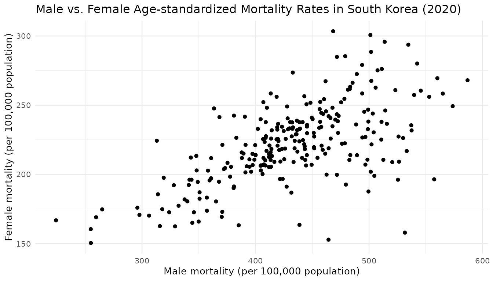

# Working with tidycensuskr

## Getting Started with tidycensuskr

The `tidycensuskr` package provides easy access to South Korean census
and socioeconomic statistics, along with corresponding geospatial
boundary data. With this package, R users can query and visualize
population, housing, economy, tax, and mortality data linked to
administrative districts.

Load the package:

``` r
library(tidycensuskr)
```

tidycensuskr will work at its full potential with the companion data
package `tidycensuskr.sf`, which contains the district boundaries of
South Korea. The package can be installed from R-universe:

``` r
install.packages("tidycensuskr.sf", repos = "https://sigmafelix.r-universe.dev")
```

After installing the companion package, three RDS files for 2010, 2015,
and 2020 will be accessible through the function
[`system.file()`](https://rdrr.io/r/base/system.file.html). For example,
the RDS file path of the 2010 district boundaries can be loaded as
follows:

``` r
fs10 <- system.file("extdata", "adm2_sf_2010.rds", package = "tidycensuskr.sf")
adm2_sf_2010 <- readRDS(fs10)
```

## 1. Understanding Korean Geographic Hierarchies

South Korean census data is organized by three levels of administrative
divisions:

- ***Si-Do***: The highest level of administrative division.
  - Metropolitan cities are treated as provinces.
  - Jeju-do, Gangwon-do, and Jeollabuk-do have special self-governing
    status under Korean law.
- ***Si-Gun-Gu***: The second level, which includes cities and counties.
  - ***Si***: Cities (urban administrative units)
  - ***Gun***: Counties (rural areas, typically \<50,000 population)
  - ***Gu***: Districts (urban subdivisions of metropolitan cities or
    large cities).
    - *Gu* under metropolitan cities are autonomous districts
    - *Gu* under 11 large cities, as of 2025 (i.e., Suwon-si,
      Seongnam-si, Anyang-si, Goyang-si, Ansan-si, Yongin-si,
      Cheongju-si, Cheonan-si, Pohang-si, Changwon-si, Jeonju-si), are
      administraitve districts
- ***Eup-Myeon-Dong***: The third level, which includes town and
  districts. (*planned for future releases*)
  - ***Eup***: Towns (urban, \>20,000 population, within a county)
  - ***Myeon***: Townships (rural, \<20,000 population, within a county)
  - ***Dong***: Neighborhoods (smallest units within cities and
    districts)

### Comparison of Administrative Divisions

The table below provides a rough comparison of administrative divisions
across South Korea, the United States, the European Union, and the
United Kingdom (England). While the correspondence is not exact, it can
be helpful to understand the approximate levels when working with census
or regional data.

| South Korea        | US                                         | EU (NUTS[¹](#fn1)) | UK (England)                   |
|--------------------|--------------------------------------------|--------------------|--------------------------------|
| **Si/Do**          | State                                      | NUTS1              | Regions / Combined Authorities |
| **Si/Gun/Gu**      | County                                     | NUTS2              | County                         |
| **Eup/Myeon/Dong** | Townships / Towns / Census County Division | NUTS3              | Districts / Wards / Boroughs   |


Because administrative boundaries and coding systems can vary across
years and data sources, `tidycensuskr` harmonizes codes to allow
consistent integration of statistics. Currently, for 2020 data there are
250 *Si-Gun-Gu* and 17 *Si-Do*.

``` r
data(adm2_sf_2020)
print(length(unique(adm2_sf_2020$adm2_code)))
#> [1] 250
```

## 2. Available census data

The package provides census and survey data through:  
- The function
[`anycensus()`](https://sigmafelix.github.io/tidycensuskr/reference/anycensus.md)
for querying subsets  
- The built-in dataset `censuskor` in long format

### Data types

| type       | class1         | class2  | unit                | description                              | available_years  | data_provider             |
|------------|----------------|---------|---------------------|------------------------------------------|------------------|---------------------------|
| population | all households | total   | persons             | Total population                         | 2010, 2015, 2020 | Statistics Korea          |
| population | all households | male    | persons             | Male population                          | 2010, 2015, 2020 | Statistics Korea          |
| population | all households | female  | persons             | Female population                        | 2010, 2015, 2020 | Statistics Korea          |
| economy    | company        | total   | count               | Number of business entities              | 2010, 2015, 2020 | Statistics Korea          |
| housing    | housing types  | total   | count               | Total number of housing units            | 2010, 2015, 2020 | Statistics Korea          |
| tax        | income         | general | million KRW         | Comprehensive Income Tax                 | 2020             | National Tax Service      |
| tax        | income         | labor   | million KRW         | Employment Income Tax                    | 2020             | National Tax Service      |
| mortality  | All causes     | total   | per 100k population | Age-standardized mortality rate          | 2020             | Statistics Korea (Survey) |
| mortality  | All causes     | male    | per 100k population | Age-standardized mortality rate (male)   | 2020             | Statistics Korea (Survey) |
| mortality  | All causes     | female  | per 100k population | Age-standardized mortality rate (female) | 2020             | Statistics Korea (Survey) |

### Query data using `anycensus()`

The function
[`anycensus()`](https://sigmafelix.github.io/tidycensuskr/reference/anycensus.md)
returns a tidy tibble with columns such as:

- `year`: year of the dataset
- `adm1`, `adm1_code`: Si-Do (province) level administrative unit name
  and its corresponding code
- `adm2`, `adm2_code`: Si-Gun-Gu (district) level administrative unit
  name and its corresponding code

Columns containing the values are added as a wide form. The column
`adm2_code` links census data directly to boundary files retrieved with
[`load_districts()`](https://sigmafelix.github.io/tidycensuskr/reference/load_districts.md).

``` r
df_2020 <- anycensus(year = 2020, 
                     type = "mortality",
                     level = "adm2")
head(df_2020)
#> # A tibble: 6 × 9
#>    year adm1              adm1_code adm2  adm2_code type  `all causes_total_p1p`
#>   <dbl> <chr>                 <dbl> <chr>     <dbl> <chr>                  <dbl>
#> 1  2020 Chungcheongbuk-do        33 Cheo…     33040 mort…                   312.
#> 2  2020 Chungcheongnam-do        34 Cheo…     34010 mort…                   321.
#> 3  2020 Gyeongsangbuk-do         37 Poha…     37010 mort…                   318.
#> 4  2020 Gyeongsangnam-do         38 Chan…     38110 mort…                   323.
#> 5  2020 Jeollabuk-do             35 Jeon…     35010 mort…                   283.
#> 6  2020 Gyeongsangbuk-do         37 Ando…     37040 mort…                   353 
#> # ℹ 2 more variables: `all causes_male_p1p` <dbl>,
#> #   `all causes_female_p1p` <dbl>
```

The function can also aggregate values to higher administrative units.
By specifying `level = "adm1"` and providing an aggregation function, we
obtain province-level (`adm1`) results that summarize across all
districts.

``` r
df_2020_sido <- anycensus(year = 2020, 
                          type = "mortality",
                          level = "adm1",
                          aggregator = sum,
                          na.rm = TRUE)
head(df_2020_sido)
#> # A tibble: 6 × 7
#> # Groups:   year, type, adm1, adm1_code [6]
#>    year type      adm1    adm1_code `all causes_total_p1p` `all causes_male_p1p`
#>   <dbl> <chr>     <chr>       <dbl>                  <dbl>                 <dbl>
#> 1  2020 mortality Busan          21                  5367.                 7327.
#> 2  2020 mortality Chungc…        33                  5160.                 7037.
#> 3  2020 mortality Chungc…        34                  5707.                 7646.
#> 4  2020 mortality Daegu          22                  2486.                 3405.
#> 5  2020 mortality Daejeon        25                  1529.                 1996 
#> 6  2020 mortality Gangwo…        32                  6125.                 8382.
#> # ℹ 1 more variable: `all causes_female_p1p` <dbl>
```

### Built-in dataset `censuskor`

You can access the whole dataset directly using the function
`data(censuskor)` which returns the built-in dataset in a long form.

- `year`: year of the dataset
- `adm1`, `adm1_code`: Si-Do (province) level administrative unit name
  and its corresponding code  
- `adm2`, `adm2_code`: Si-Gun-Gu (district) level administrative unit
  name and its corresponding code
- `type`: Types of census or survey
- `class1`, `class2`: Classification variables providing further
  breakdowns
- `unit`: Measurement unit for the value
- `value`: The observed census value for the given combination of year,
  region, and category

``` r
data(censuskor)
head(censuskor)
#> # A data frame: 6 × 10
#>    year adm1          adm1_code adm2  adm2_code type  class1 class2 unit   value
#> * <dbl> <chr>             <dbl> <chr>     <dbl> <chr> <chr>  <chr>  <chr>  <dbl>
#> 1  2010 Chungcheongb…        33 Cheo…     33010 popu… all h… total  pers… 646939
#> 2  2010 Chungcheongb…        33 Cheo…     33010 popu… all h… male   pers… 318355
#> 3  2010 Chungcheongb…        33 Cheo…     33010 popu… all h… female pers… 328584
#> 4  2020 Chungcheongb…        33 Cheo…     33040 tax   income gener… mill… 524478
#> 5  2020 Chungcheongb…        33 Cheo…     33040 tax   income labor  mill… 598560
#> 6  2015 Chungcheongb…        33 Cheo…     33040 popu… all h… total  pers… 797099
```

### Quick Visualization

Since
[`anycensus()`](https://sigmafelix.github.io/tidycensuskr/reference/anycensus.md)
returns tidy data, visualization with `ggplot2` is straightforward.

``` r
ggplot(df_2020, aes(x = `all causes_male_p1p`, y = `all causes_female_p1p`)) +
  geom_point() +
  labs(
    x = "Male mortality (per 100,000 population)",
    y = "Female mortality (per 100,000 population)",
    title = "Male vs. Female Age-standardized Mortality Rates in South Korea (2020)"
  ) +
  theme_minimal(base_size = 10)
```



------------------------------------------------------------------------

1.  NUTS: *Nomenclature of Territorial Units for Statistics*, a geocode
    standard for referencing the subdivisions of countries for
    statistical purposes.
