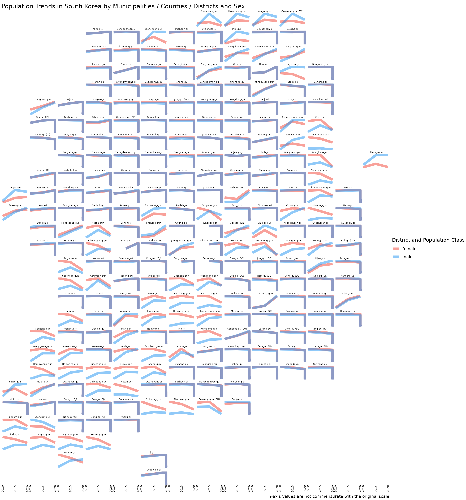

# tidycensuskr 분석 갤러리

## 예제 1: 한국 경제 활동의 공간적 자기상관

### 설계 아이디어

이 예제에서는 모란 *I* 통계량을 사용하여 2020년 한국의 경제 활동의
공간적 분포를 분석합니다. 경제 활동 지표는 시군구 별 사업체 수로
측정합니다.

- 전역적 모란 *I* 지수는 전체적인 공간적 자기상관이 존재하는지, 즉 기업
  수가 비슷한 지역들이 전국적으로 뭉쳐 있는 경향이 있는지를 평가합니다.
- 국지적 모란 *I* 지수 (또는 국지적 자기상관지표, LISA)는 각 구역을 네
  가지 유형으로 분류하여 국지적인 군집과 이상치를 식별합니다:
  - 높음-높음 (H-H): 높은 값을 가진 구역이 다른 높은 값을 가진 구역들로
    둘러싸인 경우.
  - 낮음-낮음 (L-L): 낮은 값을 가진 구역이 다른 낮은 값을 가진 구역들로
    둘러싸인 경우.
  - 높음-낮음 (H-L): 높은 값을 가졌으나 낮은 값을 가진 이웃들로 둘러싸인
    잠재적 공간 이상치.
  - 낮음-높음 (L-H): 낮은 값을 가졌으나 높은 값을 가진 이웃들로 둘러싸인
    잠재적 공간 이상치.

결과로 얻어지는 LISA 군집 지도는 주변 지역에 비해 경제 활동이 집중된
곳과 희소한 곳을 강조합니다.

### 데이터 준비

``` r

# Load 2020 boundaries
data(adm2_sf_2020)

# Load 2020 economy data
df_2020_economy <- anycensus(
  year = 2020,
  type = "economy"
)

# Merge with spatial data
adm2_sf_2020_economy <- adm2_sf_2020 |>
  dplyr::inner_join(df_2020_economy, by = "adm2_code")

# Variable of interest: number of companies
var <- adm2_sf_2020_economy$company_total_cnt
```

### 전역적(Global) Moran’s I

``` r

# Build neighbors (queen contiguity) and spatial weights
nb <- poly2nb(adm2_sf_2020_economy, queen = TRUE)
lw <- nb2listw(nb, style = "W", zero.policy = TRUE)

# Global Moran's I test
global_moran <- moran.test(var, lw, zero.policy = TRUE)
global_moran
```

    ## 
    ##  Moran I test under randomisation
    ## 
    ## data:  var  
    ## weights: lw  
    ## n reduced by no-neighbour observations  
    ## 
    ## Moran I statistic standard deviate = 10.35, p-value < 2.2e-16
    ## alternative hypothesis: greater
    ## sample estimates:
    ## Moran I statistic       Expectation          Variance 
    ##       0.424571643      -0.004149378       0.001715960

### 국지적(Local) Moran’s I 및 LISA 지도

``` r

# Local Moran's I
local_moran <- localmoran(var, lw, zero.policy = TRUE)

# Bind results back to sf object
adm2_sf_2020_economy <- adm2_sf_2020_economy |>
  mutate(
    Ii   = local_moran[, "Ii"],
    pval = local_moran[, "Pr(z != E(Ii))"]
  )

mean_var <- mean(var, na.rm = TRUE)

adm2_sf_2020_economy <- adm2_sf_2020_economy |>
  mutate(
    cluster = case_when(
      var > mean_var & Ii > 0 & pval <= 0.05 ~ "High-High",
      var < mean_var & Ii > 0 & pval <= 0.05 ~ "Low-Low",
      var > mean_var & Ii < 0 & pval <= 0.05 ~ "High-Low",
      var < mean_var & Ii < 0 & pval <= 0.05 ~ "Low-High",
      TRUE ~ "Not significant"
    )
  )

ggplot(adm2_sf_2020_economy) +
  geom_sf(aes(fill = cluster), color = "grey70", size = 0.05) +
  scale_fill_manual(
    values = c(
      "High-High" = "red",
      "Low-Low" = "blue",
      "High-Low" = "pink",
      "Low-High" = "lightblue",
      "Not significant" = "white"
    )
  ) +
  labs(title = "LISA Cluster Map of Company units (2020)") +
  theme_minimal()
```


결과는 경제 활동이 고도로 수도권에 집중되어 있음을 보여줍니다. 높음-높음
(H-H) 군집은 주로 서울 수도권 지역에 위치하여 이 지역이 한국 경제에서
차지하는 중심적인 역할을 보여줍니다. 낮음-낮음 (L-L) 군집은 강원도와
전라북도, 전라남도, 경상북도, 충청남도의 경계 지역에 나타나며, 이는 기업
출현이 지속적으로 낮은 지역임을 나타냅니다. 이러한 공간적 패턴은 경제
활동에서의 수도권의 우위와 외곽 지역의 기업의 상대적 희소성을
반영합니다.

## 예제 2: 성별 및 지역별 인구 변화

### 설계 아이디어

1.  `tidycensuskr`에 포함된 `censuskor` 데이터를 불러와 adm2 레벨의 성별
    인구수에 집중합니다.
2.  시간이 지남에 따른 지역명 변경, 승격, 경계 조정을 반영하여 행정 구역
    코드를 정리하고 정렬합니다.
3.  인구수를 비교 가능한 단위(천 명)로 변환하고 일관된 라벨링을 위해
    가장 최근의 지역명을 유지합니다. 중복 지역명 (예, 남구, 서구, 고성군
    등)을 구분하기 위해 시군구 이름을 시도 약칭을 붙인 이름으로
    재구성합니다.
4.  2020년 행정 구역 경계를 기반으로 `geofacet` 그리드를 준비합니다.
5.  남성과 여성의 인구 추세를 선형 차트를 사용하여 중첩 시각화합니다.

``` r

# load packages
library(geofacet)

# load bundled data in tidycensuskr
data(censuskor)
data(adm2_sf_2020)
data(kr_grid_adm2_sgis_2020)

# prepare geofacet grid data
# Use the newest adm2_code and name if one got its name changed or promoted
pop <- censuskor |>
  dplyr::filter(
    type == "population" & class1 == "all households"
  ) |>
  dplyr::rename(code = adm2_code) |>
  dplyr::filter(class1 == "all households", class2 != "total") |>
  dplyr::mutate(
    value = value / 1000,
    code = dplyr::case_when(
      # Michuhol-gu (i.e., 23030 to 23090)
      code == 23030 ~ 23090,
      # Yeoju-si
      code == 31320 ~ 31280,
      # Dangjin-si
      code == 34390 ~ 34080,
      TRUE ~ code
    )
  ) |>
  dplyr::arrange(code, class2, -year) |>
  dplyr::group_by(code) |>
  dplyr::mutate(adm2 = adm2[which.max(year)]) |>
  dplyr::ungroup()

head(pop)
```

    ## # A tibble: 6 × 12
    ##    year adm1  adm1_code adm2       code type     class1 class2 unit  value adm3 
    ##   <dbl> <chr>     <dbl> <chr>     <dbl> <chr>    <chr>  <chr>  <chr> <dbl> <chr>
    ## 1  2020 Seoul        11 Jongno-gu 11010 populat… all h… female pers… 72.6  NA   
    ## 2  2020 Seoul        11 Jongno-gu 11010 populat… all h… female pers…  4.75 Saji…
    ## 3  2020 Seoul        11 Jongno-gu 11010 populat… all h… female pers…  1.25 Samc…
    ## 4  2020 Seoul        11 Jongno-gu 11010 populat… all h… female pers…  5.04 Buam…
    ## 5  2020 Seoul        11 Jongno-gu 11010 populat… all h… female pers…  9.27 Pyeo…
    ## 6  2020 Seoul        11 Jongno-gu 11010 populat… all h… female pers…  4.32 Muak…
    ## # ℹ 1 more variable: adm3_code <dbl>

``` r

# for a geofacet plot
# map codes to district names for facet labels
pop_name_map <- pop %>%
  dplyr::distinct(code, adm2) %>%
  {
    setNames(.$adm2, .$code)
  }

pop_labels <- pop %>% dplyr::distinct(code, adm2)

# Adjust for the identical district names in different provinces
kr_grid_adm2_sgis_2020 <-
  kr_grid_adm2_sgis_2020 |>
  dplyr::mutate(
    name = dplyr::case_when(
      grepl("^32", code) & name == "Goseong-gun" ~ "Goseong-gun (GW)",
      grepl("^38", code) & name == "Goseong-gun" ~ "Goseong-gun (GN)",
      grepl("^11", code) & name == "Jung-gu" ~ "Jung-gu (SE)",
      grepl("^21", code) & name == "Jung-gu" ~ "Jung-gu (BU)",
      grepl("^22", code) & name == "Jung-gu" ~ "Jung-gu (DG)",
      grepl("^23", code) & name == "Jung-gu" ~ "Jung-gu (IC)",
      grepl("^25", code) & name == "Jung-gu" ~ "Jung-gu (DJ)",
      grepl("^26", code) & name == "Jung-gu" ~ "Jung-gu (UL)",
      grepl("^21", code) & name == "Seo-gu" ~ "Seo-gu (BU)",
      grepl("^22", code) & name == "Seo-gu" ~ "Seo-gu (DG)",
      grepl("^23", code) & name == "Seo-gu" ~ "Seo-gu (IC)",
      grepl("^24", code) & name == "Seo-gu" ~ "Seo-gu (GJ)",
      grepl("^25", code) & name == "Seo-gu" ~ "Seo-gu (DJ)",
      grepl("^26", code) & name == "Seo-gu" ~ "Seo-gu (UL)",
      grepl("^21", code) & name == "Nam-gu" ~ "Nam-gu (BU)",
      grepl("^22", code) & name == "Nam-gu" ~ "Nam-gu (DG)",
      grepl("^24", code) & name == "Nam-gu" ~ "Nam-gu (GJ)",
      grepl("^26", code) & name == "Nam-gu" ~ "Nam-gu (UL)",
      grepl("^21", code) & name == "Dong-gu" ~ "Dong-gu (BU)",
      grepl("^22", code) & name == "Dong-gu" ~ "Dong-gu (DG)",
      grepl("^23", code) & name == "Dong-gu" ~ "Dong-gu (IC)",
      grepl("^24", code) & name == "Dong-gu" ~ "Dong-gu (GJ)",
      grepl("^25", code) & name == "Dong-gu" ~ "Dong-gu (DJ)",
      grepl("^26", code) & name == "Dong-gu" ~ "Dong-gu (UL)",
      grepl("^21", code) & name == "Buk-gu" ~ "Buk-gu (BU)",
      grepl("^22", code) & name == "Buk-gu" ~ "Buk-gu (DG)",
      grepl("^24", code) & name == "Buk-gu" ~ "Buk-gu (GJ)",
      grepl("^26", code) & name == "Buk-gu" ~ "Buk-gu (UL)",
      grepl("^11", code) & name == "Gangseo-gu" ~ "Gangseo-gu (SE)",
      grepl("^21", code) & name == "Gangseo-gu" ~ "Gangseo-gu (BU)",
      TRUE ~ name
    )
  )
```

### 스몰 멀티플(Small multiples)

이 디자인은 각 시군구의 상대적 위치를 반영하는 공간 구조를 최대한
유지하면서 이질적인 지역 인구 변화 추이를 강조합니다.

``` r

ggplot(data = pop) +
  geom_line(
    aes(x = year, y = value, group = interaction(adm2, class2), color = class2),
    alpha = 0.5,
    linewidth = 1.5
  ) +
  facet_geo(~code, grid = kr_grid_adm2_sgis_2020, label = "name", scale = "free_y") +
  labs(
    title = "Population Trends in South Korea by Sex and District",
    x = "Year",
    y = "",
    color = "Population Class",
    caption = "Y-axis values are not commensurate with the original scale"
  ) +
  scale_color_manual(values = c(female = "#F44336", male = "#2196F3")) +
  theme_void() +
  scale_x_continuous(
    breaks = sort(unique(pop$year)),
    labels = function(x) sprintf("%d", as.integer(x))
  ) +
  theme(
    strip.text = element_text(
      size = 5,
      margin = margin(0.05, 0.05, 0.05, 0.05, "cm")
    ),
    strip.background = element_blank(),
    axis.text.x = element_text(size = 6, angle = 90, hjust = 1),
    axis.text.y = element_blank(),
    panel.spacing = grid::unit(1, "pt"),
    plot.margin = margin(1, 1, 1, 1, "mm")
  )
```


