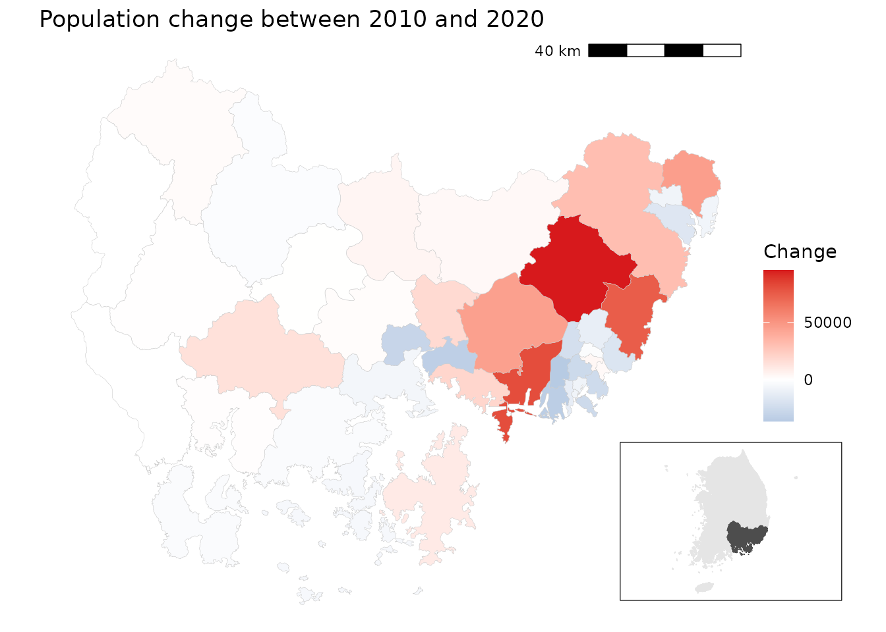
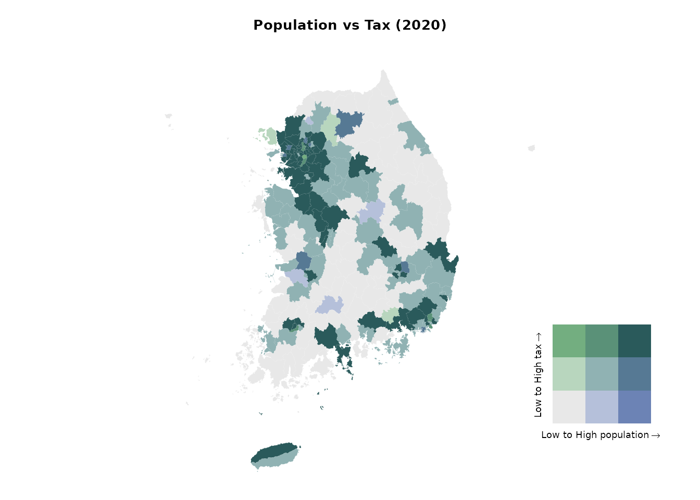
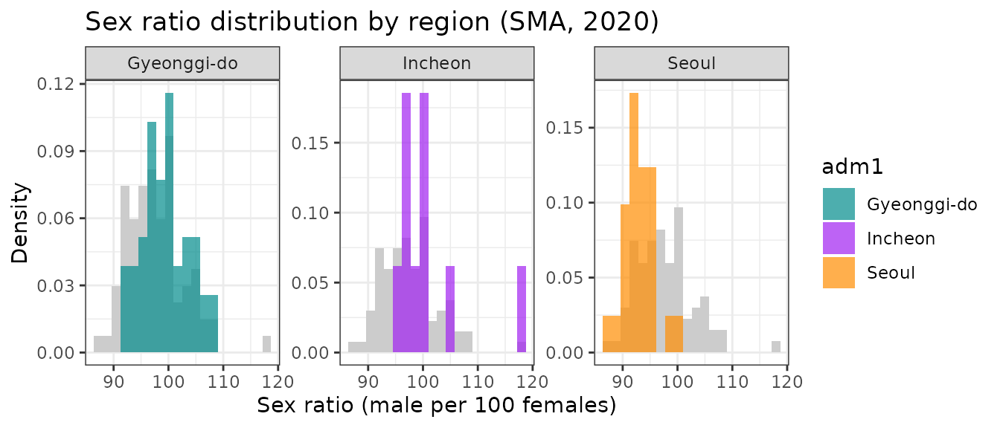
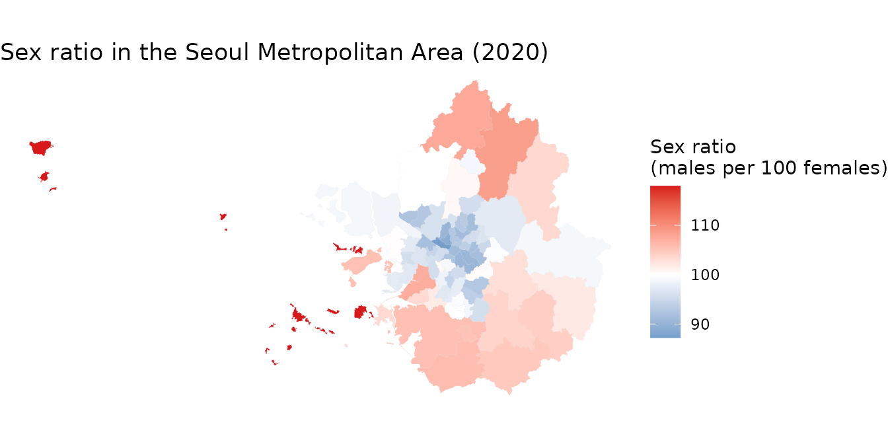
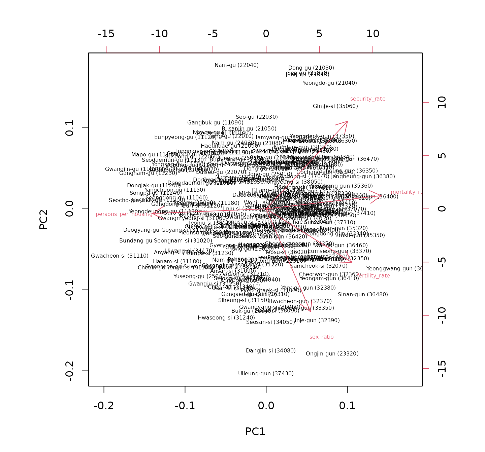

# 지역분석 예제

## Example 1: Population change in the Gyeongsangnam-do region

## 예제 1: 경상남도의 인구 변화

### 디자인 아이디어

1.  2010년과 2020년 인구 센서스 데이터를 불러옵니다.
2.  2020년 행정구역 경계와 병합합니다.
3.  인구 변화(`change = 2020 - 2010`)를 계산합니다.
4.  경상남도, 부산, 울산으로 하위셋을 만듭니다.
5.  인구 증감을 보여주는 발산형 색상 지도와, 해당 지역을 강조한 대한민국
    인셋 지도를 만듭니다.

### 데이터 준비

``` r
# 2020년 경계 불러오기
data(adm2_sf_2020)
```

``` r
# Load census population data for 2010 and 2020
df_2010_pop <- anycensus(year = 2010,
                         codes = c("Gyeongsangnam-do", "Busan", "Ulsan"),
                         type = "population")
df_2020_pop <- anycensus(year = 2020,
                         codes = c("Gyeongsangnam-do", "Busan", "Ulsan"),
                         type = "population")

# Merge with spatial data and compute population change
sf_target <- adm2_sf_2020 |>
  inner_join(df_2010_pop, by = "adm2_code") |>
  inner_join(df_2020_pop, by = "adm2_code") |>
  mutate(change = `all households_total_prs.y` - `all households_total_prs.x`)
```

### 삽입도가 있는 단계구분도

``` r
# Choropleth map for population change
map <- ggplot(sf_target) +
  geom_sf(aes(fill = change), color = "gray80", size = 0.1) +
  labs(title = "Population change between 2010 and 2020") +
  scale_fill_gradient2(
    low = "#2C7BB6", mid = "white", high = "#D7191C",
    midpoint = 0,
    name = "Change"
  ) +
  theme_void() +
  annotation_scale(
    location = "tr", width_hint = 0.25, text_cex = 0.7, line_width = 0.7
  )

# National boundary (union of all districts)
sf_korea_boundary <- adm2_sf_2020 |>
  summarise(geometry = st_union(geometry))

# Target region boundary (union of selected provinces/cities)
sf_target_boundary <- sf_target |>
  summarise(geometry = st_union(geometry))

# Inset map: whole Korea + highlighted target region
korea_inset <- ggplot() +
  geom_sf(data = sf_korea_boundary, fill = "grey90", color = "grey90") +
  geom_sf(data = sf_target_boundary, fill = "grey30", color = "grey30") +
  theme_void()

# Combine main map and inset
cowplot::ggdraw() +
  cowplot::draw_plot(map) +
  cowplot::draw_plot(
    korea_inset, x = 0.7, y = 0.05, width = 0.25, height = 0.25
  ) +
  draw_grob(grid::rectGrob(gp = gpar(col = "black", fill = NA, lwd = 0.6)),
            x = 0.7, y = 0.05, width = 0.25, height = 0.25)
```



경상남도에서는 해안가 지역과 대도시 주변에서 인구가 두드러지게 감소했고,
특히 부산과 울산의 중심지구에서 그 경향이 뚜렷합니다. 반면, 내륙의 일부
농촌 지역에서는 인구 증가가 관찰됩니다. 서부에서는 인구 추이가 비교적
안정적입니다.

## 예시 2: 인구와 조세의 이변량 지도

### 디자인 아이디어

1.  2020년 인구와 조세 데이터를 불러옵니다.
2.  일반구가 있는 대도시의 구 단위 데이터가 없으므로, 4자리 접두
    수준으로 집계합니다.
3.  인구와 조세 데이터를 병합합니다.
4.  [`biscale::bi_class()`](https://chris-prener.github.io/biscale/reference/bi_class.html)
    함수를 사용하여 인구(x)와 조세(y)의 3\*3 이변량 분류를 만듭니다.
5.  사용자 정의 범례와 함께 이변량 단계구분도를 그립니다.

### 데이터 준비

``` r
# Load census data
df_2020_pop <- anycensus(year = 2020, 
                         type = "population")
df_2020_tax <- anycensus(year = 2020, 
                         type = "tax")

# Merge population with boundaries
adm2_sf_2020_pop <- adm2_sf_2020 |>
  left_join(df_2020_pop, by = "adm2_code") |>
  mutate(
    adm2_code_chr = as.character(adm2_code),
    adm2_prefix4  = substr(adm2_code_chr, 1, 4),
    last_digit    = substr(adm2_code_chr, 5, 5)
  )

# Aggregate smaller units (adm2_code ending not with 0) into 4-digit groups
sf_union_needed <- adm2_sf_2020_pop |>
  filter(last_digit != "0") |>
  group_by(adm2_prefix4) |>
  summarise(
    across(where(is.numeric), ~ sum(.x, na.rm = TRUE)),
    geometry = st_union(geometry),
    .groups = "drop"
  ) |>
  mutate(adm2_code = as.numeric(paste0(adm2_prefix4, "0")))

# Combine aggregated units with existing "0"-ending districts
adm2_sf_2020_unioned <- adm2_sf_2020_pop |>
  filter(last_digit == "0") |>
  bind_rows(sf_union_needed)

# Join with tax data
sf_final <- adm2_sf_2020_unioned |>
  left_join(df_2020_tax, by = "adm2_code")
```

### 이변량 지도

``` r
# Create 3x3 bivariate classes (population vs tax)
bi_data <- bi_class(
  sf_final,
  x = `all households_total_prs`,
  y = income_general_mkr,
  style = "quantile",
  dim = 3
)

# Bivariate legend
legend <- bi_legend(
  pal = "DkCyan", dim = 3,
  xlab = "Low to High population",
  ylab = "Low to High tax",
  size = 7
)

# Mapping
cowplot::ggdraw() +
  cowplot::draw_plot(
    ggplot() +
      geom_sf(data = bi_data, aes(fill = bi_class), color = NA) +
      bi_scale_fill(pal = "DkCyan", dim = 3, guide = "none") +
      bi_theme() +
      labs(title = "Population vs Tax (2020)") +
      theme(plot.title = element_text(size = 10))
  ) +
  cowplot::draw_plot(legend, x = 0.7, y = 0.1, width = 0.3, height = 0.3)
```



이변량 단계구분도로부터 높은 값들이 수도권에 집중되어 있음을 알 수
있습니다. 서울특별시 및 그 동남부의 경기도 시군에서 인구와 조세 수입이
모두 높게 나타납니다. 반면에 강원특별자치도와 경상북도 등 대부분
지역에서는 인구와 조세 수입이 모두 낮습니다.

## 예시 3: 수도권의 성비

### 디자인 아이디어

1.  2020년 수도권(서울, 인천, 경기)의 인구 데이터를 불러옵니다.
2.  성비(`남성/여성 × 100`)를 계산합니다.
3.  성비 분포를 시각화합니다:
    - 전체 분포는 회색 배경 히스토그램으로 표시합니다.
    - 지역별 분포(서울, 인천, 경기)는 색상을 주어 겹쳐 표시하고, 각각을
      분할면(facet)으로 나눕니다.
4.  구 단위로 성비를 나타내는 단계구분도를 만듭니다. 동일 성비(100)를
    중심으로 발산형 색상 척도를 사용합니다.

### 데이터 준비

``` r
# Load population data for the Seoul Metropolitan Area (SMA)
df_sma <- anycensus(
  year  = 2020,
  codes = c("Seoul", "Gyeonggi-do", "Incheon"),
  type  = "population"
)

# Calculate sex ratio (males per 100 females)
df_sma <- df_sma |>
  mutate(
    sex_ratio = `all households_male_prs` / `all households_female_prs` * 100
  )

# Extract overall distribution (all SMA combined)
df_all <- df_sma |>
  select(sex_ratio)
```

### 히스토그램 그리기

``` r
ggplot() +
  # Background: overall distribution across all SMA
  geom_histogram(
    data = df_all,
    aes(x = sex_ratio, y = after_stat(density)),
    bins = 20, fill = "grey80", color = NA, alpha = 1
  ) +
  # Regional distributions
  geom_histogram(
    data = df_sma,
    aes(x = sex_ratio, y = after_stat(density), fill = adm1),
    bins = 20, alpha = 0.7, color = NA, position = "identity"
  ) +
  facet_wrap(~ adm1, ncol = 3, scales = "free_y") +
  scale_fill_manual(values = c(
    "Seoul" = "darkorange",
    "Incheon" = "purple",
    "Gyeonggi-do" = "cyan4"
  )) +
  labs(
    title = "Sex ratio distribution by region (SMA, 2020)",
    x = "Sex ratio (male per 100 females)",
    y = "Density"
  ) +
  theme_bw()
```



### 단계구분도

``` r
# Merge SMA population data with boundaries
adm2_sf_2020_sma <- adm2_sf_2020 |>
  inner_join(df_sma, by = "adm2_code")

# Choropleth map for sex ratio
ggplot(adm2_sf_2020_sma) +
  geom_sf(aes(fill = sex_ratio), color = "gray", size = 0.01) +
  scale_fill_gradient2(
    low = "#2C7BB6", mid = "white", high = "#D7191C",
    midpoint = 100,                        # 100 = equal male/female
    name = "Sex ratio\n(males per 100 females)"
  ) +
  labs(title = "Sex ratio in the Seoul Metropolitan Area (2020)") +
  theme_void()
```



수도권 지역에서 서울 주요 구에서는 성비가 낮지만 (여성 인구가 더 많음),
외곽 지역으로 갈수록 성비가 높아지는 경향이 있습니다. 이로부터 수도권
내에서 성비의 공간적 분포가 다름을 알 수 있습니다.

## 예시 4: 사회경제적 상태를 종합적으로 파악하기 (프로파일링)

### 배경

지역 단위의 사회경제적 상태는 주거 여건, 인구 특성, 사망률, 사회보장
이용률 등 다양한 지표를 통해 파악할 수 있습니다. 이러한 다변량 자료의
차원을 축소하는 데에 주성분 분석(PCA)이 유용합니다. PCA는 상관된
변수들의 그룹을 찾아내고, 이를 소수의 해석 가능한 성분들로 요약하는 데
도움을 줍니다.

### 디자인 아이디어

1.  [`anycensus()`](https://sigmafelix.github.io/tidycensuskr/ko/reference/anycensus.md)
    함수를 여러 번 사용하여 2020년 인구, 주거, 사망률, 사회보장 데이터를
    불러옵니다.
2.  `adm2_code`의 4자리 접두 수준, 즉 기초지방자치단체(BLG) 단위로
    집계하여 가로로 긴 형식의 데이터 프레임을 만듭니다.
3.  기초지방자치단체의 특성을 반영하도록 변수를 집계합니다(인구수 합계,
    비율 평균 등).
4.  선택한 사회경제적 지표들에 대해 PCA를 수행하고, 결과를
    이분도(바이플롯)로 시각화합니다.

### 데이터 준비

``` r
library(tidycensuskr)
library(dplyr)
library(ggplot2)
library(janitor)

# Load data
sf_2020 <- data(adm2_sf_2020)

# housing
df_hou <- anycensus(year = 2020, type = "housing", level = "adm2")
df_hou <- df_hou |>
  dplyr::group_by(adm1_code, adm2_code, year, type) |>
  dplyr::mutate(dplyr::across(
    dplyr::everything(),
    ~ ifelse(is.na(.), .[which(!is.na(.))], .)
  )) |>
  dplyr::ungroup() |>
  dplyr::distinct()

# population
df_pop <- anycensus(year = 2020, type = "population", level = "adm2")

# mortality
df_mort <- anycensus(year = 2020, type = "mortality", level = "adm2")

# social security
df_ss <- anycensus(year = 2020, type = "social security", level = "adm2")


# Combine data frames
df_wide <- Reduce(
  function(x, y) {
    left_join(
      x, y,
      by = c("adm1", "adm1_code", "adm2", "adm2_code", "year")
    )
  },
  list(
    df_hou,
    df_pop,
    df_mort,
    df_ss
  )
) |>
  dplyr::select(-dplyr::starts_with("type"))

# reorganize the variables by basic local governments
df_wide_re <-
  df_wide |>
  dplyr::mutate(adm2_code_ = paste0(substr(adm2_code, 1, 4), "0")) |>
  dplyr::group_by(adm2_code_) |>
  dplyr::summarize(
    dplyr::across(
      dplyr::matches("households|income|housing|grdp|security"),
      ~ sum(.x, na.rm = TRUE)
    ),
    dplyr::across(
      dplyr::matches("fertility|causes"),
      ~ mean(.x, na.rm = TRUE)
    ),
    adm2 = dplyr::first(adm2)
  ) |>
  dplyr::ungroup() |>
  dplyr::transmute(
    adm2_code_ = adm2_code_,
    adm2 = adm2,
    persons_per_housing = `all households_total_prs` / `housing types_total_cnt`,
    sex_ratio = 100 * `all households_male_prs` / `all households_female_prs`,
    mortality_rate = `all causes_total_p1p`,
    fertility_rate = fertility_total_brt,
    security_rate = 100 * (`basic living security_female_prs` + `basic living security_male_prs`) /
      `all households_total_prs`
  )
```

### 주성분분석 결과

주성분 분석(PCA)을 수행한 후, 회전 행렬을 살펴보면 첫 번째 성분이
출산율, 사망률, 기초생활보장 수급률과 중간 정도의 상관관계를 가지며,
주택당 인구수와는 음의 상관관계를 나타냅니다. 두 번째 성분은 성비와
기초생활보장 수급률과 각각 음의 상관관계와 양의 상관관계를 지니고
있습니다.

``` r
# Run PCA
prc_df <-
  df_wide_re |>
  dplyr::select(3:7) |>
  as.data.frame() |>
  prcomp(scale = TRUE)

# Rotation by variables
prc_df$rotation |> as.data.frame() |> round(3)
```

    ##                        PC1    PC2    PC3    PC4    PC5
    ## persons_per_housing -0.554 -0.032 -0.221  0.733  0.324
    ## sex_ratio            0.216 -0.704 -0.565  0.119 -0.353
    ## mortality_rate       0.560  0.090 -0.362 -0.009  0.739
    ## fertility_rate       0.418 -0.368  0.678  0.475  0.065
    ## security_rate        0.397  0.600 -0.205  0.471 -0.468

### 이분도(biplot)

첫 번째와 두 번째 주성분을 이용해서 이분도를 그려봅니다. 이 그림은 각
시군구를 점으로 표시하고, 개별 변수를 화살표로 나타내 주성분분석에
사용된 여러 변수들 간의 관계를 이해하는 데 도움을 줍니다. 또한 그 관계가
지역별로 어떻게 다른지도 파악할 수 있습니다. 해석의 편의를 위해서 각
시군구의 이름과 코드를 라벨로 표시합니다.

``` r
# Proper labeling for biplot for BLGs
adm2labels <- paste0(df_wide_re$adm2, " (", df_wide_re$adm2_code_, ")")
rownames(prc_df$x) <- adm2labels

# Biplot with PC1 and PC2
biplot(prc_df, choices = c(1, 2), cex = 0.5, arrow.len = 0.2)
```



이분도에서는 흥미로운 점을 찾아볼 수 있습니다. 성비는 주택당 인구
과밀도나 사망률과는 독립적(즉, 화살표가 거의 직각을 이룸)이며
기초생활수급자 비율과는 음의 상관관계를 보입니다(즉, 화살표가 반대
방향을 향함). 서울특별시의 구는 대부분 제2사분면에 위치하여 낮은 성비와
높은 기초생활수급자 비율을 나타내고, 경기도 외곽의 시군에서는 높은
성비와 낮은 기초생활수급자 비율이 관찰됩니다. 내륙과 접경 지역은 대체로
높은 기초생활수급자 비율과 관련이 있어 해당 지역의 사회경제적 어려움을
시사합니다. 이 분석은 한국 내 다양한 지역 간의 사회경제적 격차에 대한
통찰을 제공합니다.
