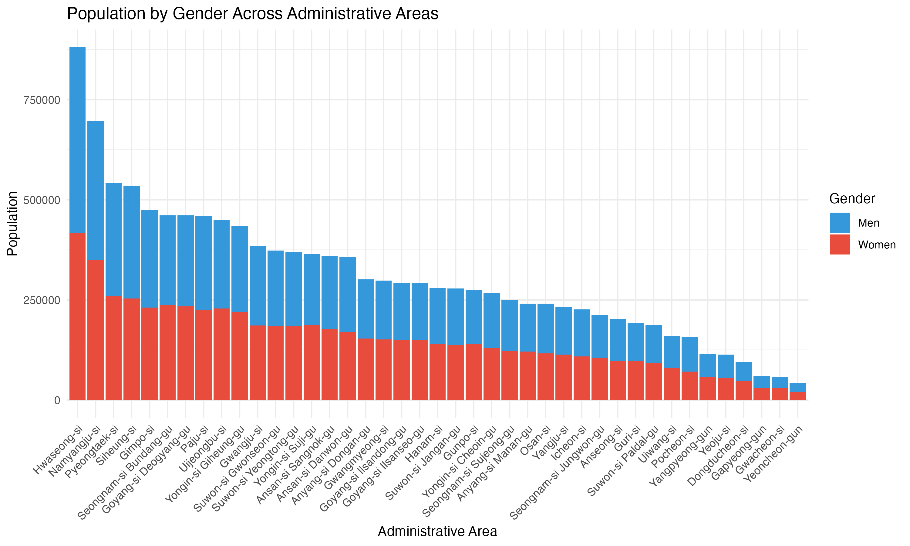

```{r setup, include=FALSE}
knitr::opts_chunk$set(echo = TRUE)
```

```r
gg2020 <- anycensus(31, 2020, df)

head(gg2020)
```

```
# A tibble: 41 × 7
#>   adm1_code adm1_name   adm2_code adm2_name            pop2020_total pop2020_men pop2020_women
#>       <dbl> <fct>           <dbl> <chr>                        <int>       <int>         <int>
#> 1        31 Gyeonggi-do     31011 Suwon-si Jangan-gu          278507      140771        137736
#> 2        31 Gyeonggi-do     31012 Suwon-si Gwonseon-gu        373381      188046        185335
#> 3        31 Gyeonggi-do     31013 Suwon-si Paldal-gu          187922       95112         92810
#> 4        31 Gyeonggi-do     31014 Suwon-si Yeongtong-…        370340      185687        184653
#> 5        31 Gyeonggi-do     31021 Seongnam-si Sujeong…        249044      125587        123457
#> 6        31 Gyeonggi-do     31022 Seongnam-si Jungwon…        211880      106618        105262
```


```r
library(ggplot2)
library(tidyr)
library(dplyr)

# Reshape data from wide to long format
df_long <- df %>%
  pivot_longer(cols = c(pop2020_men, pop2020_women),
               names_to = "gender",
               values_to = "population") %>%
  mutate(gender = case_when(
    gender == "pop2020_men" ~ "Men",
    gender == "pop2020_women" ~ "Women"
  ))

# Create stacked bar chart
ggplot(df_long, aes(x = adm2_name, y = population, fill = gender)) +
  geom_col() +
  labs(title = "Population by Gender Across Administrative Areas",
       x = "Administrative Area",
       y = "Population",
       fill = "Gender") +
  theme_minimal() +
  theme(axis.text.x = element_text(angle = 45, hjust = 1)) +
  scale_fill_manual(values = c("Men" = "#3498db", "Women" = "#e74c3c"))
```




~~Understanding Sido → Sigungu → Eupmyeondong relationships
Aggregating Eupmyeondong data to Sigungu level
Handling administrative boundary changes~~


