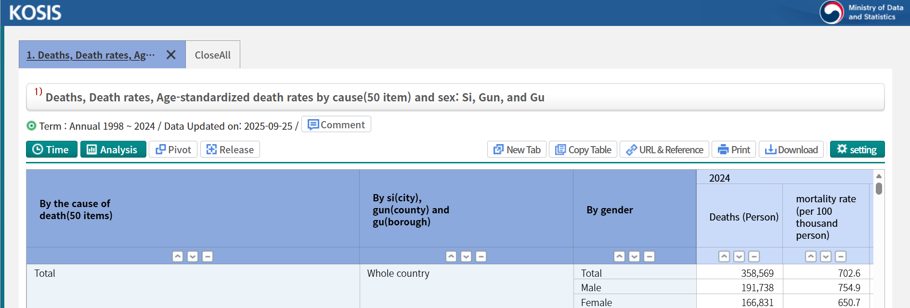
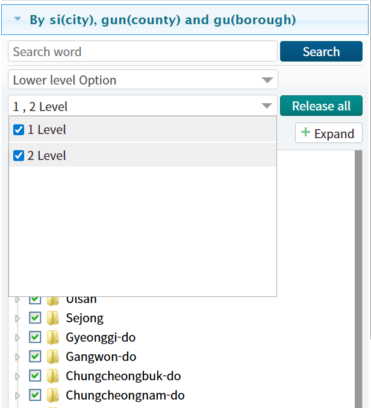
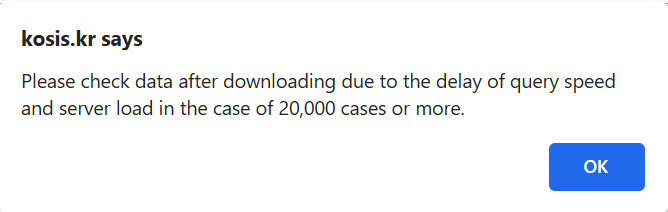
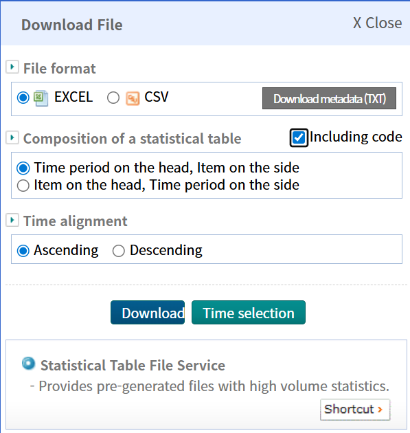
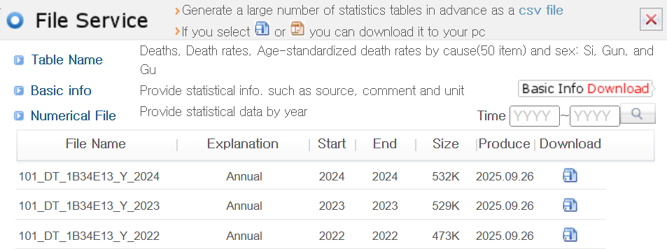

```{r setup, include=FALSE}
knitr::opts_chunk$set(
  collapse = TRUE,
  comment = "#>"
)
```

## 목표
이 도움 문서는 기여자들이 패키지의 `censuskor` `data.frame`에 추가할 데이터 검색을 위해 KOSIS(국가통계포털) 인터페이스를 효과적으로 사용하는 방법에 대한 가이드를 제공합니다. 4번 도움 문서(v04)에서는 KOSIS 개방 API URL을 사용하여 관심 있는 데이터를 검색하는 방법을 소개했습니다. 그런데 많은 경우 사용자가 KOSIS 웹페이지에서 직접 데이터를 다운로드하는 것이 편리할 수 있습니다. 이 문서의 내용을 따라가면서 기여자는 다음을 수행할 수 있는 환경에 익숙해질 것입니다:

1. KOSIS 인터페이스를 탐색하여 관련 데이터셋 찾기.
2. KOSIS 플랫폼에서 제공하는 다양한 데이터 다운로드 옵션 익히기.
3. 패키지 포함을 위해 데이터 추출 및 포맷팅하기.

## KOSIS 인터페이스 탐색
먼저 [KOSIS](https://kosis.kr/eng/) 웹사이트를 방문하십시오. 검색창을 사용하거나 카테고리를 탐색하여 관심 분야와 관련된 데이터셋을 찾아 보십시오. `tidycensuskr`는 시, 군, 구 수준의 데이터를 제공하므로 검색창에 "시군구"(검색엔진이 다소 경직적이므로 일부 데이터셋을 찾으려면 시군구 사이에 점을 찍어야 할 수 있습니다)를 입력하여 사용 가능한 데이터셋 목록을 조회할 수 있습니다. 목록에서 데이터셋 중 하나를 누르면 데이터셋 탐색 도구가 있는 새 창으로 이동합니다. 아래는 '사망, 사망률, 사인별 연령표준화 사망률(50항목) 및 성별: 시, 군 및 구' 데이터셋에 대한 KOSIS 인터페이스의 화면 캡처를 보여줍니다.

{width=100%}


## 다운로드 옵션 설정

기본 화면에는 선택된 변수 세트 또는 시군구 지역이 표시됩니다. 툴바의 가장 오른쪽에 있는 "조회설정" 버튼을 클릭하여 선택을 사용자 정의할 수 있습니다. 사이드바가 나타나면 관심 변수, 연도 및 지역을 선택할 수 있습니다. 모든 시군구 지역을 선택하려면 "행정구역" 탭 아래의 "2단계 선택" 버튼을 클릭하십시오. 그러면 모든 시군구 지역의 체크박스가 활성화됩니다. "1단계 선택" 버튼은 시도(대도시/지방) 수준의 지역만 선택하며, 이는 대다수 데이터셋의 기본값입니다. 참고할 점은 세종시와 같은 일부 단일 구역 도시는 때때로 "2단계 선택" 아래에 나열되지 않을 수 있다는 것입니다. 이 경우 해당 지역의 상자를 수동으로 체크해야 합니다.



### 크기 제한에 대한 참고사항

조합의 수가 너무 많으면 KOSIS 서버가 처리하기에 너무 큰 쿼리가 발생하여 KOSIS 설정에 의해 금지됩니다. 기본 설정은 한 쿼리 인스턴스당 20,000셀입니다. 아래 화면 캡처와 같은 오류 메시지가 나타날 수 있습니다.




이 문제를 피하려면 선택한 연도 또는 변수의 수를 제한해야 합니다. 예를 들어 가장 최근 연도에만 관심이 있다면 최신 연도를 제외한 다른 모든 연도의 선택을 취소하십시오. 마찬가지로 변수의 하위 집합에만 관심이 있다면 나머지는 선택 취소하십시오. 이렇게 하면 다운로드해야 할 파일이 여러 개로 나뉘게 되며, 정제를 위해 이 파일들을 하나로 결합하는 추가 후처리 단계가 필요합니다.

## 데이터 다운로드
원하는 옵션을 설정했으면 사이드바 오른쪽 상단의 "다운로드" 버튼을 클릭하세요. 화면 중앙에 다운로드 형식 옵션이 있는 팝업이 나타납니다. 대부분의 데이터셋은 엑셀 워크시트(.xls) 및 쉼표로 구분된 값(.csv) 형식을 지원하며, 일부 작은 데이터셋의 경우 SAS 또는 최신 엑셀 워크시트(.xlsx)와 같은 추가 형식도 사용할 수 있습니다.



팝업 중간에 있는 "코드 포함" 체크박스를 꼭 선택하십시오. 이 옵션은 다운로드된 데이터에 지역 및 변수에 필요한 통계 코드를 포함하도록 하여, 데이터 병합 및 분석을 쉽게 해 줍니다. 메타데이터 정보의 경우 "메타정보 다운로드(TXT)" 버튼을 클릭하여 텍스트 메타데이터 파일을 다운로드할 수 있습니다.

자주 사용되는 데이터셋은 빠른 접근을 위해 미리 생성되어 KOSIS 서버에 저장된 상태로 제공됩니다. 이 경우 팝업에 "통계표 파일 서비스"라는 추가 섹션이 표시되고 그 아래에 "바로가기" 버튼이 있습니다. 또 다른 팝업 창이 나타나 미리 생성된 파일에 대한 직접 다운로드 링크 목록을 제공합니다. 이 파일들은 일반적으로 레코드에 대한 보조 변수와 함께 연도별로 제공됩니다.




## 데이터 후처리
데이터 파일을 다운로드한 후, 패키지에 포함하기 위해 데이터를 정제하고 포맷팅하는 몇 가지 후처리 단계를 수행해야 할 수 있습니다. 여기에는 다음이 포함될 수 있습니다:

1. 적절한 함수(예: CSV 파일의 경우 `read.csv()`, 엑셀 파일의 경우 `readxl::read_excel()`)를 사용하여 데이터를 R로 읽어오기.
2. 패키지에서 사용하는 명명 규칙에 맞게 컬럼명 변경하기.

표준 컬럼명으로는 `adm1`, `adm1_code`, `adm2`, `adm2_code`, `year`, `type`, `class1`, `class2`, `value`, `unit` 등 10개가 있습니다.

| 컬럼명 | 설명                                  |
|-------------|----------------------------------------------|
| adm1        | 시도 레벨 행정 구역명 |
| adm1_code   | 시도 레벨 행정 구역 코드 |
| adm2        | 시군구 레벨 행정 구역명 |
| adm2_code   | 시군구 레벨 행정 구역 코드 |
| year        | 데이터셋의 연도                          |
| type        | 데이터 타입 (예: 인구, 경제)       |
| class1      | 1단계 분류 수준                   |
| class2      | 2단계 분류 수준                  |
| value       | 측정값                               |
| unit        | 측정 단위                          |

3. 필요에 따라 데이터 타입 변환하기(예: 숫자형 컬럼이 `numeric` 타입인지 확인).
4. 크기 제한으로 인해 데이터가 부분적으로 다운로드된 경우 여러 파일 병합하기.
5. 데이터의 정확성과 완전성을 보장하기 위해 검증하기.
6. 정제된 데이터를 `censuskor`에 추가하고 번들 데이터셋에 등록하기(즉, `usethis::use_data(censuskor, overwrite = TRUE)`).

### 적절한 `adm2_code` 할당

KOSIS 데이터 정제는 `adm2_code` 값이 올바르게 할당되도록 특별한 주의가 필요합니다. `adm2_code`는 한국의 각 시군구 단위에 대한 고유 식별자입니다. 이는 센서스 데이터를 공간 경계 파일에 연결하는 데 중요합니다. 패키지 설치 디렉토리의 `extdata/lookup_district_code.csv` 또는 GitHub 리포지토리를 복제한 경우 `inst/extdata/lookup_district_code.csv`에 `adm2_code` 값에 대한 참조 테이블을 제공합니다. 조회 테이블에는 다음 컬럼들이 포함되어 있습니다:


| 컬럼명 | 설명                                  |
|-------------|----------------------------------------------|
| sido_kr     | 한글 시도명                      |
| sigungu_kr  | 한글 시군구명                      |
| sigungu_1_kr| 한글 대체 시군구명         |
| sigungu_2_kr| 한글 대체 시군구명         |
| sido_en     | 영문 시도명                     |
| sigun_en    | 영문 시군명                     |
| sigungu_1_en| 영문 대체 시군구명        |
| sigungu_2_en| 영문 대체 시군구명        |
| sdsgg_en    | 영문 시도 및 시군구명 병합 |
| base_year   | 코드 기준 연도                       |
| tax_exclude | 세금 제외 여부                  |
| adm2_code   | 공식 시군구 행정 구역 코드 |
| adm2_code_new | 새로운 시군구 행정 구역 코드 |
| sgg_population | 인구 데이터용 시군구 코드                 |
| sgg_housing | 주택 데이터용 시군구 코드      |
| sgg_tax_global | 종합소득세용 시군구 코드         |
| sgg_tax_income | 소득세용 시군구 코드        |
| sgg_doj | 법무부 데이터(결혼이민자 등)용 시군구 코드   |
| sgg_dcee | 기후환경에너지부 데이터(폐수 등)용 시군구 코드 |

참고로, `sigungu_kr`, `sigungu_1_kr`, `sigungu_2_kr` 컬럼은 기초지방자치단체(각 구의 상위 단위) 이름 포함 여부에 따라 다양한 버전의 한글 지역명을 제공합니다:

- `sigungu_kr`: 비자치구(일반구)에 대해 기초지방자치단체를 **포함한** 표준 지역명 (예: "고양시 일산동구")
- `sigungu_1_kr`: 비자치구(일반구)에 대해 채워진 기초지방자치단체 이름 (예: "덕양구", "일산동구", "일산서구" 모두 "고양시"로 표기)
- `sigungu_2_kr`: 비자치구(일반구)에 대해 기초지방자치단체를 **제외한** 표준 지역명 (예: "일산동구")


이 데이터는 다른 지역 코드 체계를 사용하는 새로운 데이터셋이 추가됨에 따라 확장될 수 있습니다. 기여자에게 할당할 목표 코드는 주로 `adm2_code` 필드 값입니다. 검색된 데이터 파일의 레이아웃에 따라 기여자는 지역명이나 다른 코드 체계를 대응 테이블의 `adm2_code` 값과 일치시켜야 합니다. 현재 제공되는 대응 테이블에 `base_year` 컬럼을 포함하여 연도별 지역 변경 사항을 반영했습니다. 대응 테이블을 후처리된 데이터에 조인할 때, 코드 또는 이름 컬럼**과** `base_year` 컬럼을 사용하여 매칭이 정확하도록 재확인하십시오.

연도 매칭은 매우 신중하게 수행해야 합니다. `base_year` 컬럼은 해당 `adm2_code`가 유효했던 연도를 나타냅니다. 조인할 때, 후처리된 데이터의 `year` 컬럼이 조회 테이블의 `base_year`보다 **작거나 같도록** 하십시오 (이에 관해서는 `dplyr::join_by()`의 세부 명세를 확인하시기를 권합니다). 이렇게 하면 데이터셋의 특정 연도에 맞는 올바른 `adm2_code`를 사용하고 있음을 확신할 수 있습니다.


데이터 소스에 따라 어떤 코드나 이름 컬럼을 사용할지에 대한 가이드는 아래 참조 테이블을 확인하세요:

| type | class1 | reference_code_field | Sources | Data producer | Table name | Notes |
|------|--------|---------------------|---------|---------------|------------|-------|
| economy | company | adm2_code | 경제총조사 | 통계청 |  |  |
| economy | grdp | adm2_code | 지역소득 | 통계청 |  |  |
| environment | organic_matter, wastewater |  | NA |  |  | Korean only |
| housing | housing types | sgg_housing | 주택총조사 | 통계청 | 주택유형별 주택수 |  |
|  |  |  | 실거래가격지수 | 한국부동산원 | NA |  |
| housing | vacant housing |  | NA |  |  | Korean only |
|  |  |  | NA |  |  | Korean only |
|  |  |  | NA |  |  | Korean only |
| population | all households | sgg_population | 인구총조사 | 통계청 | 인구, 가구 및 주택 |  |
| mortality | All causes | adm2_code | 인구동태통계 | 통계청 | 사망 및 사망률... |  |
| migration | marital | sgg_doj | 출입국통계 | 법무부 | 체류지별 결혼이민자 현황 |  |
|  |  |  | 국내이동통계 | 통계청 | 시군구별 이동자 수 |  |
|  |  | adm2_code | 인구동태통계 | 통계청 | 시군구별 월별 이혼 |  |
|  |  | adm2_code | 인구동태통계 | 통계청 | 시군구별 월별 혼인 |  |
| population | fertility | adm2_code | 인구동태통계 | 통계청 | 시군구별 합계출산율... |  |
| medicine | doctors | adm2_code | 건강보험통계연보 | 건강보험심사평가원 | NA |  |
|  |  | adm2_code | 건강보험통계연보 | 건강보험심사평가원 | NA |  |
|  |  |  | 지역사회건강조사 | 질병관리청 | 월간 음주율 |  |
| tax | income | sgg_tax_income | 국세통계 | 국세청 |  | Korean only |
|  | general | sgg_tax_general | 국세통계 | 국세청 |  | Korean only |
|  |  |  | 국세통계 | 국세청 | NA | Korean only |
|  |  |  | 국세통계 | 국세청 | NA | Korean only |
|  |  |  | 국세통계 | 국세청 | NA | Korean only |
|  |  |  | 자동차주행거리통계 | 한국교통안전공단 | 시군구별 차종별 주행거리 |  |
|  |  |  | 국민연금통계 | 국민연금공단 | NA |  |
| welfare | facilities | sido_en, sigungu_2_en | 복지통계 | 한국사회보장정보원 |  | Korean only |
| welfare | registered physically mentally challenged | sido_en, sigungu_2_en | 복지통계 | 한국사회보장정보원 |  | Korean only |
| welfare | registered physically mentally challenged severity | sido_en, sigungu_2_en | 복지통계 | 한국사회보장정보원 |  | Korean only |
| social security | basic living security | sido_en, sigungu_2_en | 복지통계 | 한국사회보장정보원 |  | Korean only |
| social security | basic pension | sido_en, sigungu_2_en | 복지통계 | 한국사회보장정보원 |  | Korean only |


### 후처리 예제 코드
다운로드한 CSV 파일을 읽고, 정제하고, 적절한 `adm2_code` 값을 할당하는 방법을 보여주는 예제 코드 조각입니다:


1. 한글 지역명과 `base_year`를 사용하여 조인하기:

후처리된 데이터에 `adm2kr` (한글 지역명)과 `year` 컬럼이 포함되어 있다고 가정합니다.

```r
library(dplyr)

# fixed path to the lookup table
lookup_path <- system.file("extdata/lookup_district_code.csv", package = "tidycensuskr")
lookup_district_code <- read.csv(lookup_path)

# Read the postprocessed CSV file
pratedata <- read.csv("path/to/downloaded_file.csv")

joinby <- dplyr::join_by(
  adm2kr == sigungu_2_kr,
  year <= base_year
)

# join with lookup table to assign adm2_code
cleaned_data <- pratedata |>
  dplyr::left_join(
    lookup_district_code,
    by = joinby
  )
```

2. 대체 지역 코드(예: `sgg_population`)와 `base_year`를 사용하여 조인하기:

후처리된 데이터에 `sggcd` (법무부 데이터용 대체 지역 코드)와 `year` 컬럼이 포함되어 있다고 합시다.

```r
library(dplyr)

# fixed path to the lookup table
lookup_path <- system.file("extdata/lookup_district_code.csv", package = "tidycensuskr")
lookup_district_code <- read.csv(lookup_path)

# Read the postprocessed CSV file
dojdata <- read.csv("path/to/downloaded_file.csv")

joinby <- dplyr::join_by(
  sggcd == sigungu_doj,
  year <= base_year
)

# join with lookup table to assign adm2_code
cleaned_data <- dojdata |>
  dplyr::left_join(
    lookup_district_code,
    by = joinby
  )
```
